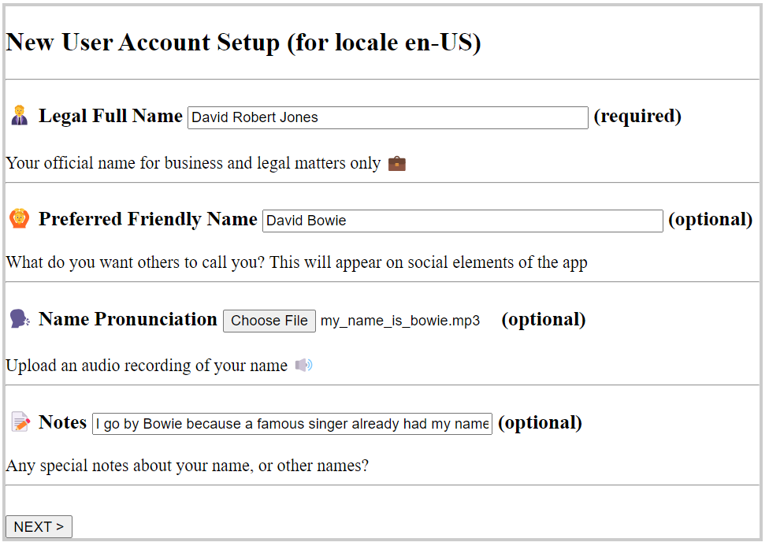

# personalnameform
A form to capture a user's personal name as best as possible, whether they have a simple or anti-pattern identity.

As based on:

https://www.w3.org/International/questions/qa-personal-names

and

https://medium.com/@sprutzman/what-if-last-name-is-actually-the-first-name-localizing-personal-names-in-software-6dd04547e572

Much of the source code was started from the W3Schools guide:

https://www.w3schools.com/html/html_forms.asp
